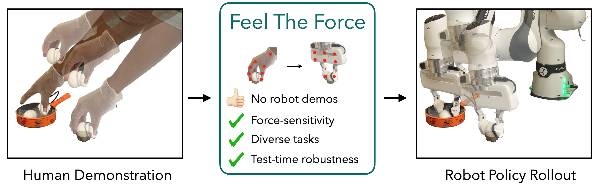

<p align="center">
    
</p>


<h1 align="center" style="font-size: 2.0em; font-weight: bold; margin-bottom: 0; border: none; border-bottom: none;">Feel The Force:<br>Contact-Driven Learning from Humans</h1>

##### <p align="center">[Ademi Adeniji<sup>*12</sup>](https://ademiadeniji.github.io/)&emsp;[Zhuoran Chen<sup>*3</sup>](https://www.linkedin.com/in/zhuoran-chen-90a18a251/)&emsp;[Vincent Liu<sup>1</sup>](https://vliu15.github.io)</p>
##### <p align="center">[Venkatesh Pattabiraman<sup>1</sup>](https://venkyp.com/)&emsp;[Siddhant Haldar<sup>1</sup>](https://siddhanthaldar.github.io/)&emsp;[Raunaq Bhirangi<sup>1</sup>](https://raunaqbhirangi.github.io/)&emsp;[Pieter Abbeel<sup>2</sup>](https://people.eecs.berkeley.edu/~pabbeel/)&emsp;[Lerrel Pinto<sup>1</sup>](https://lerrelpinto.com)</p>
##### <p align="center"><sup>1</sup>New York University&emsp;<sup>2</sup>UC Berkeley&emsp;<sup>3</sup>New York University Shanghai</p>
##### <p align="center"><sup>*</sup>Equal contribution</p>


<div align="center">
    <a href="https://arxiv.org/abs/2506.01944"></a> &ensp;
    <a href="https://feel-the-force-ftf.github.io/"></a> &ensp;
</div>

## table of contents
- [Setup](#SetUp)
- [Data Collection](#Data-Collection)
- [Data Preprocessing](#Data-Preprocessing)
- [Training](#Training)
- [Inference](#Inference)
- [Command Line Argument Table](#Command-Line-Argument-Table)

Instructions for Setup are based on [Franka-Teach](https://github.com/NYU-robot-learning/Franka-Teach).
Instructions for Data Collection and Data Preprocessing are based on [Point Policy](https://github.com/siddhanthaldar/Point-Policy/tree/main/instructions). 

## Setup

1. Start the deoxys control process on the NUC
SSH into the NUC. You can check drivers with `tmux ls`. To attach to them:
```bash
tmux attach -t franka_arm
tmux attach -t franka_gripper
```

To restart drivers, start two separate tmux sessions—one for the arm, one for the gripper:

```bash
# Arm control (left or right)
tmux new -s franka_arm
cd ~/work/deoxys_control/deoxys
./auto_scripts/auto_arm.sh config/franka_left.yml
# Use config/franka_right.yml for the right arm
```
Open a new terminal:
```bash
tmux new -s franka_gripper
cd ~/work/deoxys_control/deoxys
./auto_scripts/auto_gripper.sh config/franka_left.yml
```

2. Franka Interface Desktop
Open your local terminal:
```bash
alias start_right_franka="ssh -NL localhost:8000:172.16.0.4:443 robot-lab@10.19.248.70"
alias start_left_franka="ssh -NL localhost:8000:172.16.1.4:443 robot-lab@10.19.248.70"
```

After running either tunnel, go to `https://localhost:8000/desk/` to access the Franka Desktop. The username is `GRAIL` and the password is `grail1234`.


3. Conda Environment
In your Lambda, clone the repository with the submodules:
```
git clone git@github.com:feel-the-force-ftf/feel-the-force.git --recurse-submodules
```
Then set up conda environment:

```bash
conda env create -f conda_env.yaml
conda activate force
bash setup.sh
```
Make sure you stay around to enter your `sudo` password and `0.13.3` as the libfranka version when prompted

4. Start Servers

```bash
cd /path/to/Franka-Teach/
python3 franka_server.py
python3 camera_server.py # in a different terminal
```

If you need to collect ReSkin tactile data during data collection, you should also run:

```bash
cd /path/to/Franka-Teach/
python3 reskin.py  # in a different terminal
```
Make sure the ReSkin device is properly connected via USB. 
In `path/to/Franka-Teach/configs/reskin.yaml`, edit the `reskin_config`:

```yaml
reskin_config:
  port: "/dev/ttyACM0"
  num_mags: 5
  history: 40
```

If connected correctly, the reskin.py script will output the force values detected by the ReSkin sensor in real time. 

To view camera stream, run:
```bash
cd ./cameras
bash launch_camera_servers.sh
```

To view the camera feeds:
```bash
bash launch_camera_app.sh
```
Then type `http://172.24.71.211:5000` in your internet browser search bar.

After launching these, you may test that the Franka environment works with `python eval.py`, which should breakpoint in `outer_step()` before the force controller loop.


## Data Collection

1. Start the teleoperation script. Set the teleop mode based on if you are collecting human or robot demonstrations:

```bash
python3 teleop.py teleop_mode=<human/robot>
```
You can also specify parameters in `path/to/Franka-Teach/configs/teleop.yaml` file.

Keep this script running. If it outputs `Assertion error`, you need to terminal data collection and restart the script.

2. Start data collection by running the `collect_data.py` script. Set the `demo_num` to the number of demonstrations you want to collect and `collect_reskin` to `True` if you want to collect ReSkin tactile data.

```bash
python3 collect_data.py demo_num=0 collect_reskin=<True/False>
```
You can also specify parameters in `path/to/Franka-Teach/configs/collect_data.yaml` file.

When collecting either human or robot data, use the VR controller to start and stop the data collection while performing the actions.

Restart `collect_data.py` script after each demonstration.

## Data Preprocessing

- NOTE: Before generating task data, we first need generate the calibration file.
    - For calibration, generate the pkl file without points for the calibration data (collected using Franka Teach) and make sure to set the `PATH_DATA_PKL` to the data pickle file for the calib data first.
    - Next generate the calib file using the following command
    ```
    cd calibration
    python generate_r2c_extrinsic.py
    cd ..
    ```
    - This will generate the calib file in `point_policy/calib/calib.npy`.
      
1. Convert data format

   
Go to the robot utils Franka directory.
```
cd point-policy/robot_utils/franka
```
 Once you have collected the human data using Franka Teach, process it to remove pauses and save it in a nicer format.
```
python process_data_human.py --data_dir path/to/data --task_names <task_name>
```
2. Convert the data to a pickle file (without processing key points)
```
python convert_to_pkl_human.py --data_dir path/to/data --calib_path path/to/calib_file --task_names <task_name> --process_points False
``` 

3. Label semantically meaningful points for each task
 `point-policy/robot_utils/franka/label_points.ipynb`

4. Save pickle data with key point labels (both for the human hand and object points obtained through human annotations)
```
python convert_to_pkl_human.py --data_dir path/to/data --calib_path path/to/calib_file --task_names <task_name> --process_points --smooth_tracks
```
NOTE:
- The `calib_path` must be set to `<root_dir>/calib/calib.npy` where `<root_dir>` is the root directory of the repository. The `data_dir` must be set to the directory where the data is stored during teleoperation (`path/to/data`).
- The generated pkl files with robot actions will be stored in `path/to/data/expert_demos/franka_env`. The variable `data_dir` in `config.yaml` and `config_eval.yaml` in `point_policy/cfg` must be set to `path/to/data/expert_demos`.


5. Convert human hand poses to robot actions
```
python convert_pkl_human_to_robot.py --data_dir path/to/data --calib_path path/to/calib_file --task_name <task_name> --smooth_robot_tracks 
```

You can check robot points labeling with `python save_videos.py`. Remember to set DATA_DIR and TASK_NAME in the script.

6. Processing robot demonstrations
   
If you are processing robot demonstrations (e.g., collected via teleoperation), follow these steps:

The process is slightly different from processing human demonstrations (no need to run convert_pkl_human_to_robot.py) :
```
1. process_data_robot.py        
2. convert_to_pkl_robot.py     
3. label_points.ipynb           # Label keypoints as in human demo
4. convert_to_pkl_robot.py      # Re-run with `--process_points` to include keypoints
```


## Training

1. In `cfg/config.yaml`, set `root_dir`  to `path/to/repo` and `data_dir` to `path/to/data/expert_demos`. All commands must be run from inside the `point-policy` directory.


2. Create yaml file (eg. `0414_clip_chip.yaml`) under `path/to/point_policy/cfgs/suite/task/franka_env`. The file should contain the following content:
```bash
defaults:
  - _self_

task_name: 0414_clip_chip
object_labels: [objects]
num_object_points: 7
```

3. Training

Command:
```
python train.py agent=point_policy suite=point_policy dataloader=point_policy eval=false suite.use_robot_points=true suite.use_object_points=true suite/task/franka_env=<task_name> experiment=point_policy suite.predict_force=true suite.mask_force=false
```
You can specify parameters in `path/to/point_policy/cfgs/suite/point_policy.yaml`.

Detailed command arguments can be found in the [Command Line Argument Table](#Command-Line-Argument-Table).

## Inference

In `cfg/config.yaml`, set `root_dir`  to `path/to/repo` and `data_dir` to `path/to/expert_demos`.

Command:
```
python eval_point_track.py agent=point_policy suite=point_policy dataloader=point_policy eval=true suite.use_robot_points=true suite.use_object_points=true experiment=eval_point_policy suite/task/franka_env=<task_name> bc_weight=path/to/bc/weight suite.predict_force=true
```


Detailed command arguments can be found in the [Command Line Argument Table](#Command-Line-Argument-Table).

## Command Line Argument Table
Tables below provide references for setting the correct command-line arguments during different stages (Preprocessing, Training, Inference) for both Human and Robot Teleop demonstrations.  
Settings vary depending on the gripper type (FTF, Binary Gripper, or Continuous Gripper) and demo source.
Refer to this table before launching training or inference to ensure correct configurations.

#### Human Demo Configuration

| Stage        | FTF                                                                 | Binary Gripper                                                        | Continuous Gripper                                                      |
|--------------|----------------------------------------------------------------------|------------------------------------------------------------------------|--------------------------------------------------------------------------|
| Preprocessing |                                                                      |                                                                        | when you run `convert_to_pkl_human_to_robot` with `--continuous_gripper` |
| Training     | `suite=point_policy`  <br> `suite.subsample=3` <br> `suite.mask_force=false` | `suite=point_policy`  <br> `suite.subsample=3` <br> `suite.mask_force=false` | `suite=point_policy` <br> `suite.subsample=3`                            |
| Inference    | `suite=point_policy` <br> `suite.variable_desired_force=true` <br> `suite.force_match_tolerance=?` <br> `suite.force_controller=true` <br> `suite.continuous_gripper=false` | `suite=point_policy` <br> `suite.continuous_gripper=false`              | `suite=point_policy` <br> `suite.continuous_gripper=true`                |


#### Robot Teleop Demo Configuration

| Stage     | FTF                                                                          | Binary Gripper                                                                | Continuous Gripper                       |
|-----------|-------------------------------------------------------------------------------|--------------------------------------------------------------------------------|-------------------------------------------|
| Training  | `suite=p3po` <br> `suite.subsample=15` <br> `suite.binarize_gripper_data=true` | `suite=p3po` <br> `suite.subsample=15` <br> `suite.binarize_gripper_data=true` | `suite=p3po` <br> `suite.subsample=15` <br> `suite.continuous_gripper=true` |
| Inference | `suite=p3po` <br> `suite.variable_desired_force=true` <br> `suite.force_match_tolerance=?` <br> `suite.force_controller=true` <br> `suite.continuous_gripper=false` | `suite=p3po` <br> `suite.continuous_gripper=false`                          | `suite=p3po` <br> `suite.continuous_gripper=true`                          |


